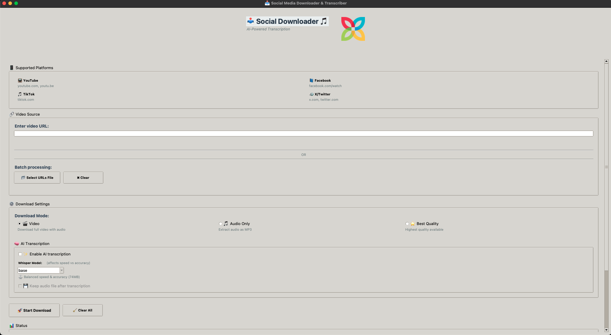

# 📥 Social-Download-Transcribe

**Công cụ đa nền tảng để download video/audio và trích xuất transcript từ YouTube, Facebook, TikTok, và X (Twitter) sử dụng AI Whisper.**


## 🖼️ Screenshot



*Giao diện chính của Social Downloader - Modern UI với logo, scrollable content, và real-time progress tracking*

## ✨ Tính năng chính

🎯 **Multi-Platform Support**: Hỗ trợ YouTube, Facebook, TikTok, X/Twitter  
🧠 **AI Transcription**: Sử dụng OpenAI Whisper để transcript chính xác  
⚡ **Batch Processing**: Xử lý hàng loạt URLs từ file  
🎮 **Dual Interface**: Cả GUI và CLI interface  
📊 **Progress Tracking**: Hiển thị tiến trình download real-time  
🔧 **Flexible Output**: Multiple download modes và quality options  
📁 **Auto Organization**: Tự động tổ chức files theo loại  
📦 **Portable Build**: Tạo executable standalone không cần cài đặt

## ⚡ Quick Start

### 🎮 GUI (Khuyến nghị cho người dùng mới)
```bash
# 1. Setup
source venv/bin/activate

# 2. Chạy GUI
python video_downloader_gui.py

# 3. Paste URL và click "Start Download"
```

### ⌨️ CLI (Cho power users)
```bash
# Download video đơn giản
python downloader_cli.py "https://www.youtube.com/watch?v=VIDEO_ID"

# Download với AI transcription
python downloader_cli.py "https://www.youtube.com/watch?v=VIDEO_ID" --transcribe --model base
```

### 📦 Build Portable
```bash
# Tạo executable standalone
python build_portable.py

# Hoặc build lightweight
python build_options.py --preset lightweight --generate
python build_custom.py
```  

## 🚀 Cài đặt nhanh

### 1. Clone repository
```bash
git clone <repository-url>
cd Social-Download-Transcribe
```

### 2. Setup environment
```bash
# Sử dụng script cài đặt tự động
chmod +x install.sh
./install.sh

# Hoặc cài đặt thủ công
python3 -m venv venv
source venv/bin/activate
pip3 install -r requirements.txt
pip uninstall numpy
pip install "numpy<2.0"
```

### 3. Kích hoạt environment
```bash
source venv/bin/activate
```

## 📖 Cách sử dụng

### 🎮 GUI Interface

#### GUI đa nền tảng (Khuyến nghị)
```bash
python video_downloader_gui.py
```

#### GUI riêng cho Facebook
```bash
python src/ui/facebook_downloader_gui.py
```

## 🖥️ Hướng dẫn sử dụng GUI

### 🚀 Khởi động ứng dụng
```bash
# Kích hoạt virtual environment
source venv/bin/activate

# Chạy GUI
python video_downloader_gui.py
```

### 📋 Giao diện chính


#### 1. **Header Section**
- **Logo**: Hiển thị logo Social Downloader
- **Title**: "Social Downloader" 
- **Subtitle**: "Download & Transcribe Videos from Multiple Platforms"

#### 2. **URL Input Section**
- **URL Field**: Nhập URL video từ YouTube, Facebook, TikTok, hoặc X/Twitter
- **Batch File**: Chọn file text chứa nhiều URLs (mỗi URL một dòng)
- **Platform Info**: Hiển thị platform được detect từ URL

#### 3. **Download Options**
- **Mode Selection**:
  - `Video`: Download video file (.mp4, .webm)
  - `Audio`: Download chỉ audio (.mp3, 192kbps)
  - `Best`: Chất lượng tốt nhất có sẵn
- **Quality**: Chọn chất lượng video (nếu có)

#### 4. **AI Transcription Options**
- **Enable Transcription**: Bật/tắt tính năng AI transcription
- **Whisper Model**: Chọn model AI
  - `Tiny`: Nhanh nhất, độ chính xác thấp (~1GB RAM)
  - `Base`: Cân bằng tốc độ và độ chính xác (~1GB RAM)
  - `Small`: Độ chính xác tốt (~2GB RAM)
  - `Medium`: Độ chính xác cao (~5GB RAM)
  - `Large`: Độ chính xác cao nhất (~10GB RAM)
- **Keep Audio**: Giữ file audio sau khi transcribe
- **Language**: Chọn ngôn ngữ (auto-detect mặc định)

#### 5. **Output Settings**
- **Output Folder**: Thư mục lưu files (mặc định: `output/`)
- **File Naming**: Format tên file với timestamp
- **Create Subfolders**: Tự động tạo thư mục con theo loại file

#### 6. **Control Panel**
- **Start Download**: Bắt đầu quá trình download
- **Stop**: Dừng quá trình đang chạy
- **Clear**: Xóa tất cả input
- **Open Output Folder**: Mở thư mục output

#### 7. **Progress & Status**
- **Progress Bar**: Hiển thị tiến trình download/transcribe
- **Status Text**: Thông tin chi tiết về quá trình
- **Log Area**: Hiển thị log real-time

### 🎯 Workflow sử dụng GUI

#### **Bước 1: Nhập URL**
1. Copy URL video từ browser
2. Paste vào URL field
3. Kiểm tra platform được detect đúng

#### **Bước 2: Chọn Options**
1. **Download Mode**: Chọn video/audio/best
2. **Transcription**: Bật nếu cần transcript
3. **Model**: Chọn Whisper model phù hợp
4. **Output**: Kiểm tra thư mục output

#### **Bước 3: Bắt đầu Download**
1. Click "Start Download"
2. Theo dõi progress bar
3. Đọc status messages
4. Chờ hoàn thành

#### **Bước 4: Kiểm tra kết quả**
1. Click "Open Output Folder"
2. Kiểm tra files đã download
3. Đọc transcript (nếu có)

### 📱 Batch Processing với GUI

#### **Tạo file URLs**
```bash
# Tạo file urls.txt
echo "https://www.youtube.com/watch?v=video1" > urls.txt
echo "https://www.tiktok.com/@user/video/123" >> urls.txt
echo "https://x.com/user/status/456" >> urls.txt
```

#### **Sử dụng trong GUI**
1. Click "Browse" trong Batch File section
2. Chọn file `urls.txt`
3. Chọn options cho tất cả URLs
4. Click "Start Download"

### 🎨 UI Features

#### **Real-time Validation**
- URL format validation
- Platform detection
- File existence check

#### **Progress Tracking**
- Download progress
- Transcription progress
- File processing status

#### **Error Handling**
- Clear error messages
- Retry suggestions
- Troubleshooting tips

#### **Responsive Design**
- Fixed header
- Scrollable content
- Mouse wheel support
- Cross-platform compatibility

### 🔧 Advanced Settings

#### **Custom Output Path**
1. Click "Browse" trong Output Folder
2. Chọn thư mục mong muốn
3. Files sẽ được lưu vào thư mục này

#### **Model Selection Guide**
- **Tiny/Base**: Video ngắn (< 10 phút), cần tốc độ
- **Small**: Video trung bình (10-30 phút), cân bằng
- **Medium**: Video dài (30+ phút), độ chính xác cao
- **Large**: Content quan trọng, độ chính xác tối đa

#### **Language Selection**
- **Auto-detect**: Tự động nhận diện ngôn ngữ
- **Specific Language**: Chọn ngôn ngữ cụ thể
- **Multi-language**: Hỗ trợ nhiều ngôn ngữ

### 🚨 Troubleshooting GUI

#### **App không khởi động**
```bash
# Kiểm tra dependencies
source venv/bin/activate
pip install -r requirements.txt

# Chạy với debug
python video_downloader_gui.py
```

#### **Logo không hiển thị**
- Kiểm tra file `resource/img/main_logo.png` tồn tại
- File phải có format PNG hợp lệ

#### **Download bị lỗi**
- Kiểm tra internet connection
- Thử URL khác
- Kiểm tra platform có được hỗ trợ

#### **Transcription chậm**
- Chọn model nhỏ hơn (tiny/base)
- Kiểm tra RAM available
- Đóng các ứng dụng khác

### 💡 Tips sử dụng GUI

#### **Tối ưu hiệu suất**
1. Sử dụng model phù hợp với video length
2. Đóng các ứng dụng không cần thiết
3. Đảm bảo đủ RAM cho model đã chọn

#### **Batch Processing**
1. Tạo file URLs với format đúng
2. Test với 1-2 URLs trước
3. Sử dụng model nhỏ cho batch lớn

#### **File Management**
1. Đặt tên output folder có ý nghĩa
2. Backup files quan trọng
3. Dọn dẹp files cũ định kỳ

### ⌨️ Command Line Interface

#### Cú pháp cơ bản
```bash
python downloader_cli.py [URL] [OPTIONS]
```

#### Các tham số

| Tham số | Mô tả | Mặc định |
|---------|-------|----------|
| `url` | URL video (YouTube, Facebook, TikTok, X) | - |
| `--file` | File text chứa nhiều URLs (mỗi URL một dòng) | - |
| `--mode` | Chế độ download: `video`, `audio`, `best` | `video` |
| `--transcribe` | Bật tính năng transcription | `False` |
| `--model` | Model Whisper: `tiny`, `base`, `small`, `medium`, `large` | `base` |
| `--keep-audio` | Giữ file audio sau khi transcribe | `False` |

## 🎬 Ví dụ sử dụng

### Download đơn giản
```bash
# Download video YouTube
python downloader_cli.py "https://www.youtube.com/watch?v=dQw4w9WgXcQ"

# Download chỉ audio
python downloader_cli.py "https://www.youtube.com/watch?v=dQw4w9WgXcQ" --mode audio

# Download chất lượng tốt nhất
python downloader_cli.py "https://www.youtube.com/watch?v=dQw4w9WgXcQ" --mode best
```

### Transcription với AI
```bash
# Transcribe với model cơ bản
python downloader_cli.py "https://www.youtube.com/watch?v=dQw4w9WgXcQ" --transcribe

# Transcribe với model chính xác cao
python downloader_cli.py "https://www.youtube.com/watch?v=dQw4w9WgXcQ" --transcribe --model large --keep-audio

# Transcribe audio dài (tự động chia segments)
python downloader_cli.py "https://www.youtube.com/watch?v=long_video" --transcribe --model medium
```

### Batch processing
```bash
# Tạo file URLs
echo "https://www.youtube.com/watch?v=video1" > urls.txt
echo "https://www.tiktok.com/@user/video/123" >> urls.txt
echo "https://x.com/user/status/456" >> urls.txt

# Chạy batch với transcription
python downloader_cli.py --file urls.txt --transcribe --model small
```

### Multi-platform examples
```bash
# YouTube
python downloader_cli.py "https://www.youtube.com/watch?v=xyz" --transcribe

# TikTok  
python downloader_cli.py "https://www.tiktok.com/@user/video/123" --mode video

# Facebook
python downloader_cli.py "https://www.facebook.com/watch/?v=123" --transcribe --model medium

# X/Twitter
python downloader_cli.py "https://x.com/user/status/123" --mode audio
```

## 🎛️ Whisper Models

| Model | Kích thước | Tốc độ | Độ chính xác | RAM cần |
|-------|------------|--------|--------------|---------|
| `tiny` | 39 MB | Rất nhanh | Thấp | ~1 GB |
| `base` | 74 MB | Nhanh | Trung bình | ~1 GB |
| `small` | 244 MB | Trung bình | Tốt | ~2 GB |
| `medium` | 769 MB | Chậm | Rất tốt | ~5 GB |
| `large` | 1550 MB | Rất chậm | Xuất sắc | ~10 GB |

**Khuyến nghị:**
- `tiny/base`: Video ngắn, cần tốc độ
- `small/medium`: Video dài, cần độ chính xác tốt
- `large`: Content quan trọng, cần độ chính xác cao nhất

## 📁 Cấu trúc Output

```
output/
├── video/          # Video files (.mp4, .webm)
├── audio/          # Audio files (.mp3, 192kbps) 
└── transcribe/     # Transcript files (.txt)
```

**Format tên file**: `{platform}_{timestamp}.{ext}`
- Ví dụ: `youtube_20250127-143025.mp4`

## 🏗️ Kiến trúc dự án

```
Social-Download-Transcribe/
├── src/
│   ├── modules/
│   │   ├── video_downloader.py          # Base classes
│   │   └── video_downloader_extended.py # Enhanced version
│   └── ui/
│       └── facebook_downloader_gui.py   # FB-specific GUI
├── output/                              # Downloaded files
├── downloader_cli.py                    # CLI interface
├── video_downloader_gui.py              # Main GUI
├── requirements.txt                     # Dependencies
└── install.sh                          # Setup script
```

## 📦 Build Portable Executable

### 🚀 Quick Build
```bash
# Build với logging chi tiết
python build_portable.py

# Build với preset khác
python build_options.py --preset lightweight --generate
python build_custom.py
```

### 🎯 Build Options
```bash
# List available presets
python build_options.py --list

# Standard build (full features, ~240MB)
python build_options.py --preset standard --command

# Lightweight build (basic features, ~50MB)
python build_options.py --preset lightweight --command

# Console build (debug version)
python build_options.py --preset console --command

# Directory build (faster startup)
python build_options.py --preset directory --command
```

### 📋 Build Presets

| Preset | Size | Features | Use Case |
|--------|------|----------|----------|
| **Standard** | ~240MB | Full GUI, all platforms, AI transcription | Production |
| **Lightweight** | ~50MB | GUI, basic download, no AI | Quick downloads |
| **Console** | ~240MB | Full features, debug output | Development |
| **Directory** | ~240MB | Fast startup, multiple files | Frequent use |
| **Development** | ~300MB | Debug info, dev tools | Testing |

### 🛠️ Build Process
1. **Requirements Check**: Verify Python, dependencies, files
2. **Clean Build**: Remove previous build artifacts
3. **PyInstaller Build**: Create executable with real-time logging
4. **Package Creation**: Create portable folder with all resources
5. **Verification**: Check executable and package integrity

### 📁 Output Structure
```
SocialDownloader_Portable/
├── SocialDownloader          # Main executable
├── resource/                 # App resources
│   └── img/
│       └── main_logo.png     # Logo file
├── output/                   # Download folders
│   ├── video/
│   ├── audio/
│   └── transcribe/
├── README.txt               # User instructions
└── run.sh                   # Launcher script
```

### 🎯 Distribution
- **Single Folder**: Contains everything needed
- **No Installation**: Users just double-click to run
- **Cross-platform**: Works on macOS, Windows, Linux
- **Self-contained**: All dependencies included

## 🔧 Dependencies

### Core Libraries
- `yt-dlp>=2024.4.9` - Video download engine
- `openai-whisper>=20231117` - AI transcription  
- `torch>=2.0.0` - PyTorch for Whisper
- `torchaudio>=2.0.1` - Audio processing
- `ffmpeg-python>=0.2.0` - Audio manipulation
- `tqdm>=4.66.1` - Progress bars
- `numpy<2.0` - Numerical computing
- `Pillow>=11.0.0` - Image processing for GUI
- `tk` - GUI framework

### Build Dependencies
- `pyinstaller>=6.0.0` - Executable creation
- `setuptools` - Package building

### System Requirements
- **Python**: 3.11+
- **FFmpeg**: Required cho audio processing
- **RAM**: 1-10GB tùy Whisper model
- **Storage**: Tùy theo video size
- **Build RAM**: 2-4GB for building process

## 🎯 Use Cases

🎬 **Content Creators**: Download và transcript videos cho editing  
🔬 **Researchers**: Thu thập và phân tích content social media  
♿ **Accessibility**: Tạo subtitles cho video content  
📚 **Archive**: Backup và lưu trữ content quan trọng  
🌍 **Language Learning**: Transcript để học ngôn ngữ  
📊 **Data Analysis**: Phân tích content text từ videos  

## ⚡ Workflow Process

1. **Input**: URL hoặc file chứa URLs
2. **Platform Detection**: Tự động nhận diện từ URL pattern
3. **Download**: Sử dụng yt-dlp với options tối ưu
4. **Transcription** (nếu được chọn):
   - Download audio format
   - Split thành segments bằng FFmpeg (30 phút/segment)
   - Process từng segment với Whisper
   - Combine thành transcript hoàn chỉnh
5. **Output**: Lưu vào thư mục tương ứng với timestamp

## 🔍 Troubleshooting

### Lỗi thường gặp

**1. SSL Certificate Error**
```bash
# Đã được xử lý tự động trong code
ssl._create_default_https_context = ssl._create_unverified_context
```

**2. FFmpeg not found**
```bash
# macOS
brew install ffmpeg

# Ubuntu/Debian  
sudo apt update && sudo apt install ffmpeg

# Windows
# Download từ https://ffmpeg.org/download.html
```

**3. Out of Memory (Whisper)**
```bash
# Sử dụng model nhỏ hơn
python downloader_cli.py "URL" --transcribe --model tiny
```

**4. Platform không được hỗ trợ**
```
❌ Could not detect platform from URL: [URL]
```
**Giải pháp**: Kiểm tra URL format, hỗ trợ: youtube.com, youtu.be, facebook.com, tiktok.com, twitter.com, x.com

**5. Build Portable Failed**
```bash
# Kiểm tra PyInstaller
pip install pyinstaller

# Kiểm tra dependencies
python build_options.py --preset standard --command

# Clean build
rm -rf build/ dist/ *.spec
python build_portable.py
```

**6. GUI Import Error**
```bash
# Fix import path
from src.modules.video_downloader_extended import ...

# Kiểm tra file structure
ls -la src/modules/
```

**7. Logo không hiển thị**
```bash
# Kiểm tra file logo
ls -la resource/img/main_logo.png

# Install Pillow
pip install Pillow
```

## 🤝 Contributing

1. Fork the repository
2. Create feature branch (`git checkout -b feature/amazing-feature`)
3. Commit changes (`git commit -m 'Add amazing feature'`)
4. Push to branch (`git push origin feature/amazing-feature`)
5. Open Pull Request

## 📄 License

This project is licensed under the MIT License - see the [LICENSE](LICENSE) file for details.

## 🙏 Acknowledgments

- [yt-dlp](https://github.com/yt-dlp/yt-dlp) - Powerful video downloader
- [OpenAI Whisper](https://github.com/openai/whisper) - Speech recognition AI
- [FFmpeg](https://ffmpeg.org/) - Multimedia framework
- [tqdm](https://github.com/tqdm/tqdm) - Progress bars

---

**Made with ❤️ for the community**

*Nếu project này hữu ích, hãy ⭐ star repository!*